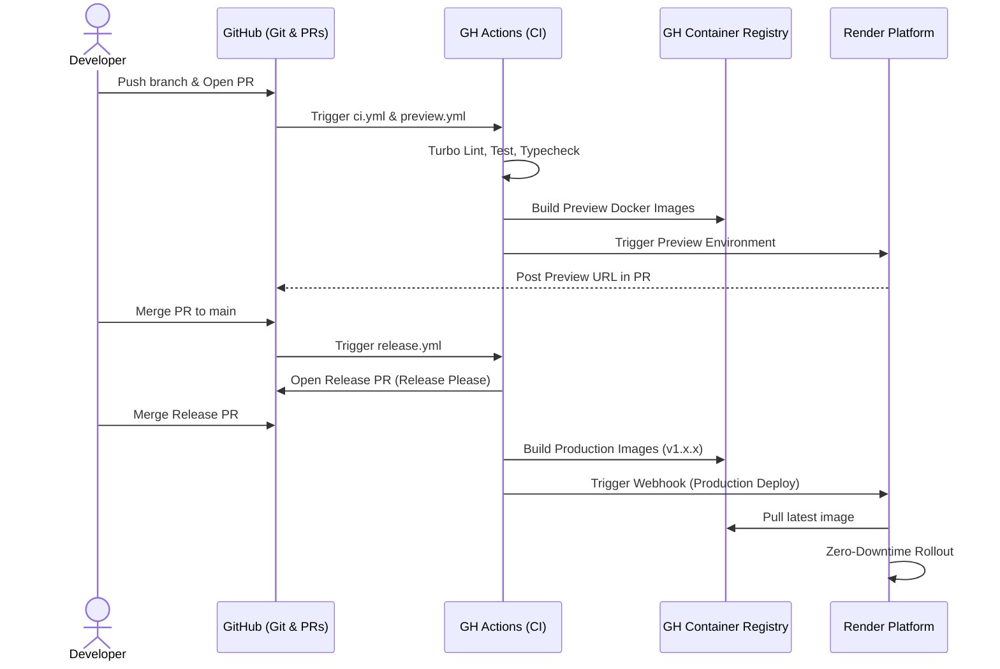

# 🚀 Complete CI/CD & Deployment Pipeline Architecture

Welcome to the internal engineering documentation for the `Rabbit-Hole-OS` project. This guide breaks down our entire GitOps, Continuous Integration, and Deployment pipeline from a developer's perspective.

---

## 🏗️ Phase 1: Repository Intelligence & Tech Stack

This repository uses a modern, monorepo-based architecture managed by **Turborepo**. The pipeline focuses on high developer velocity, automated testing, containerization, and automated deployments.

### Core Technologies
- **Monorepo Management:** Turborepo ([turbo.json](file:///c:/Users/zakau/Rabbit-Hole-OS/turbo.json))
- **CI/CD Platform:** GitHub Actions (`.github/workflows/`)
- **Codebase:** 
  - `apps/web`: Next.js (Marketing / Web Dashboard)
  - `apps/frontend`: Next.js (Desktop App UI)
  - `apps/desktop`: Electron App
  - `apps/backend`: Python / FastAPI API
- **Containerization:** Docker & Docker Buildx
- **Container Registry:** GitHub Container Registry (`ghcr.io`)
- **Deployment Platform:** Render (`render.yaml`)
- **Security Scanning:** CodeQL, TruffleHog (Secrets), Trivy (Dependencies)

---

## 🔄 Phase 2: Full Developer Lifecycle Trace

Here is exactly what happens from the moment an engineer writes code to when it reaches production.

1. **Developer writes code** and runs `npm run dev` to test across the monorepo locally.
2. **Git Commit & Push:** The developer pushes their feature branch to GitHub.
3. **Pull Request Creation:** The developer opens a PR against `develop` or `main`.
4. **CI Validation:** Opening the PR automatically triggers:
   - Security scans (TruffleHog, Trivy, CodeQL).
   - The `ci.yml` workflow, which runs Turbo `lint`, `typecheck`, and `test` specifically for the changed packages.
   - A `docker-dry-run` to ensure Dockerfiles build successfully without breaking production later.
5. **Preview Environment:** The `preview.yml` workflow builds temporary Docker images and triggers Render to spin up a fully functional **Preview Environment** for the PR. A bot comments the URL on the PR.
6. **Code Review & Merge:** Reviewers approve, and the PR is merged into `main`.
7. **Release Pipeline:** Merging into `main` triggers `release.yml`.
   - The **Release Please** action analyzes commit messages and opens a "Release PR".
   - When the "Release PR" is merged, a new semantic version tag is created.
8. **Artifact Generation:** The tagging triggers Docker Buildx to build and push production-ready images of `web` and `backend` to `ghcr.io` with the new version tag.
9. **Production Deployment:** `release.yml` fires a webhook to Render passing the new image tag. Render pulls the new image and triggers a zero-downtime deployment.

---

## ⚙️ Phase 3: CI/CD Pipeline Breakdown

All automation lives in `.github/workflows/`. Here is how they operate:

### `ci.yml` (Integration & Pre-flight)
- **Triggers on:** PRs and pushes to `main`.
- **Jobs:** Passes dynamic Turbo filters to the reusable `build.yml`. Runs a `docker-dry-run` matrix to verify `apps/web`, `apps/backend`, and `apps/frontend` can be built into containers.
- **Why it matters:** Fails the PR automatically if the build or tests break.

### `build.yml` (Reusable Build & Test)
- **Jobs:** 
  - `lint-and-typecheck`: Installs Node/Python, runs `turbo run lint typecheck`.
  - `test`: Runs `turbo run test`.
  - `build`: Runs `turbo run build`.

### `preview.yml` (Ephemeral Environments)
- **Triggers on:** PR opened, sync, closed.
- **Jobs:** Builds Docker containers via `docker.yml`, calls the Render Preview API via HTTP, and uses `github-script` to drop a comment with the live preview URLs on the PR. Cleans up when the PR closes.

### `docker.yml` (Reusable Image Builder)
- **Jobs:** Logs into `ghcr.io`, extracts metadata/tags, and uses Docker Buildx with cache layers to build and push images efficiently.

### `release.yml` (Production Deploy)
- **Triggers on:** Push to `main`.
- **Jobs:** 
  - `release-please`: Creates automated changelogs and semver tags.
  - `ci`: Verifies the main branch again.
  - `docker_build`: Builds `cognode/web` and `cognode/backend` if a new release was cut.
  - `deploy_to_production`: Uses `curl` to hit Render's Deploy Hooks, signaling Render to pull the new `ghcr.io` images.

### `security.yml`
- **Jobs:** Runs CodeQL (static analysis), TruffleHog (finds leaked secrets), and Trivy (finds vulnerable NPM/Python packages).

---

## 📦 Phase 4: Build System Analysis

The repository utilizes **Turborepo** (`turbo.json`) to map out topological dependencies and aggressive caching.

- **Frontend Build (`apps/frontend` & `apps/web`):** Uses Next.js. `npm run build` transpiles React into optimized static HTML/CSS/JS chunks.
- **Backend Build (`apps/backend`):** For production, the backend is containerized. The `Dockerfile` uses a multi-stage `python:3.11-slim` build. It compiles dependencies using a builder stage, and installs `tectonic` in the final stage for document synthesis. 
- **Desktop Build (`apps/desktop`):** Uses `electron-builder`. It pulls statically exported UI files from `../frontend/out` into its own bundle, creating `.exe` (NSIS) or `.dmg` desktop installers.

---

## 🚀 Phase 5: Deployment Architecture

The core cloud infrastructure runs on **Render**, defined declaratively via `render.yaml` inside the repository root.

- **Web Dashboard (`cognode-web-dashboard`):** Deployed as a Docker web service pulling from `apps/web/Dockerfile`. Located at `cognode.tech`.
- **Backend API (`cognode-backend`):** Deployed as a Docker web service pulling from `apps/backend/Dockerfile`. Located at `api.cognode.tech`.
- **Trigger Mechanism:** Instead of Render building the code itself from source (which is slow), GitHub Actions builds the Docker image, pushes to GHCR, and simply pings Render Deploy Hooks to pull the pre-compiled image. This guarantees that what was tested is exactly what is deployed.

---

## 🗺️ Phase 6: Pipeline Flow Diagram

---

## 👨‍💻 Phase 7: Developer Guide & FAQ

**"What happens when I push code?"**
- **To a PR:** The `ci.yml` pipeline will run, executing linters and tests only on the apps you modified (thanks to Turbo). It takes roughly 2-4 minutes. You'll also get a Render PR preview environment spun up so reviewers can click around your UI changes.
- **To main:** If your tests pass, a "Release Please" PR will be automatically generated.
- **Where are the logs?** Go to the GitHub repository > "Actions" tab. Click on your workflow run to see live logs.
- **How to fix a failing CI job?** Expand the failed job. If it's a typing error, run `npm run lint` or `npx turbo run typecheck` locally. 
- **How to re-run jobs?** Inside the GitHub Actions view, click the "Re-run all jobs" or "Re-run failed jobs" button in the upper right.

---

## 🔐 Phase 8: Environment & Secret Management

- **GitHub Secrets:** Used strictly for CI/CD operations. E.g., `REGISTRY_TOKEN`, `RENDER_WEB_DEPLOY_HOOK`, `RENDER_API_KEY`.
- **Application Environment Variables:** Production secrets (like `DATABASE_URL`, `REDIS_URL`, `GEMINI_API_KEY`) are intentionally **omitted** from code and marked as `sync: false` in `render.yaml`. They are managed directly via the secure Render Dashboard.
- **Local Dev:** Handled securely via local `.env` files which are correctly git-ignored.

---

## 🐛 Phase 9: Failure & Debugging Guide

- **Symptom: Local builds pass, but Docker Dry Run fails in CI.**
  - **Fix:** You likely added a dependency but forgot to update the Dockerfile, or it's a Linux/Windows filesystem case-sensitivity issue.
- **Symptom: Deployment failed on Render.**
  - **Fix:** Log into the Render Dashboard and check the application logs. Usually, it's a missing Environment Variable (since they are securely synced manually) or a database migration failure.
- **Symptom: Preview Environment link is dead.**
  - **Fix:** Previews take 3-5 minutes to boot via Docker on Render. If it's still dead, check the Actions tab for `preview.yml` failures.

---

## 🛡️ Phase 10: Security Review

- **The Good:** Secret scanning (TruffleHog) and Dependency scanning (Trivy + CodeQL) are active on all PRs. CI handles Docker builds passing tokens safely without leaking them.
- **Risk:** Render Deploy Hook webhooks are passed in raw URLs via `curl`. If the Action logs leak the URL, deployments could be triggered externally.
- **Recommendation:** Implement GitHub Dependabot to automatically keep dependencies patched, as Trivy only identifies them but doesn't fix them.

---

## ⚡ Phase 11: Performance Optimization

- **Current Optimization:** Turborepo natively parallelizes jobs, saving significant time. Docker uses `gha` (GitHub Actions) caching scopes.
- **Suggested Improvements:**
  - Implement **Turbo Remote Caching** using Vercel or a self-hosted S3 proxy. This would allow developers' local laptops to share build caches with GitHub Actions, cutting CI times by up to 60%.
  - `ubuntu-latest` workers have 2 cores. Large monorepos can hit a ceiling. Exploring `ubuntu-latest-4-cores` could speed up the parallel Turbo `build` and `test` jobs.

---

## 🌟 Phase 12: CI/CD Best Practices Score

**Overall Grade: A-**

- **Reliability (9/10):** Excellent separation of integration jobs from release jobs.
- **Security (9/10):** Strong multi-tool security scanning. 
- **Performance (8/10):** Turbo and Docker cache are present, but remote caching is missing.
- **Developer Experience (10/10):** Automated PR Preview environments and automatic SemVer changelog generation are top-tier DX features.
- **Scalability (9/10):** The monorepo structure easily supports adding new services without reinventing workflows.
