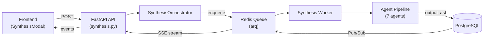
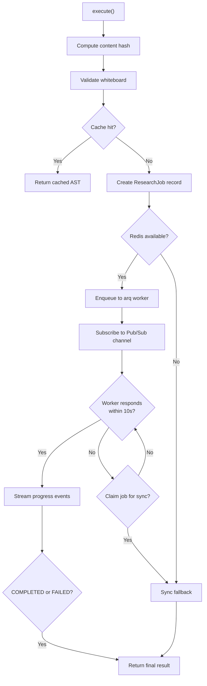
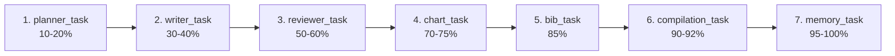
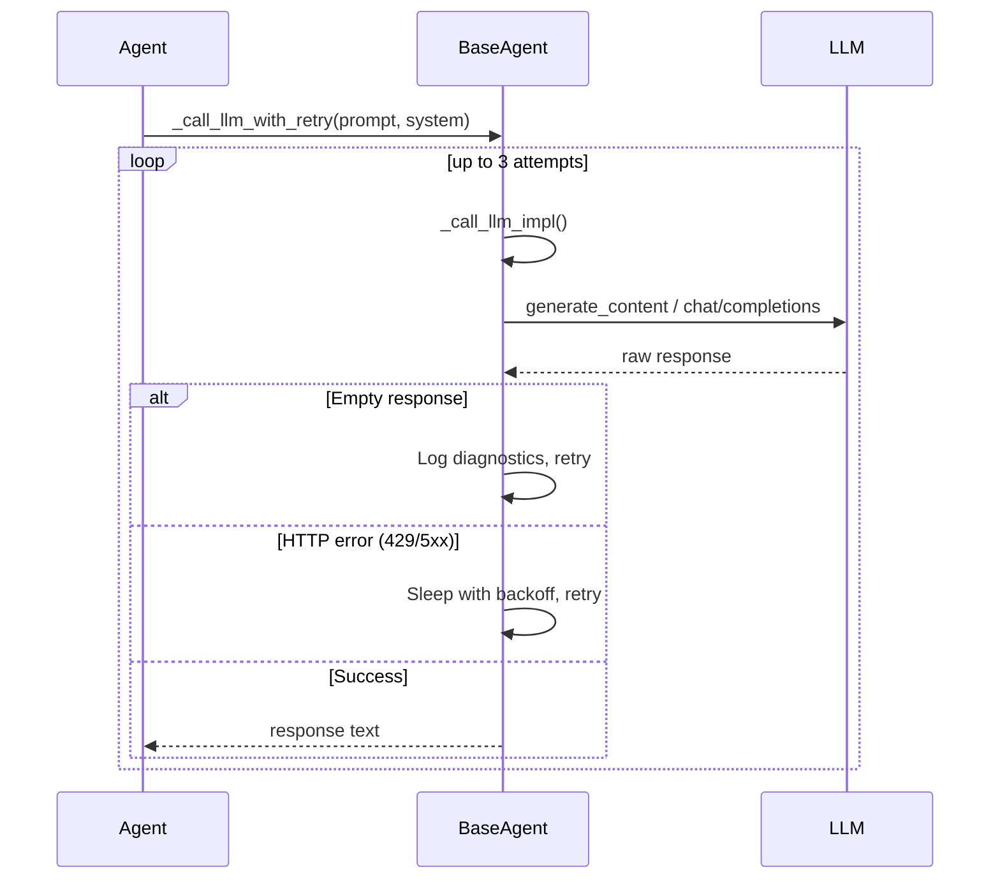
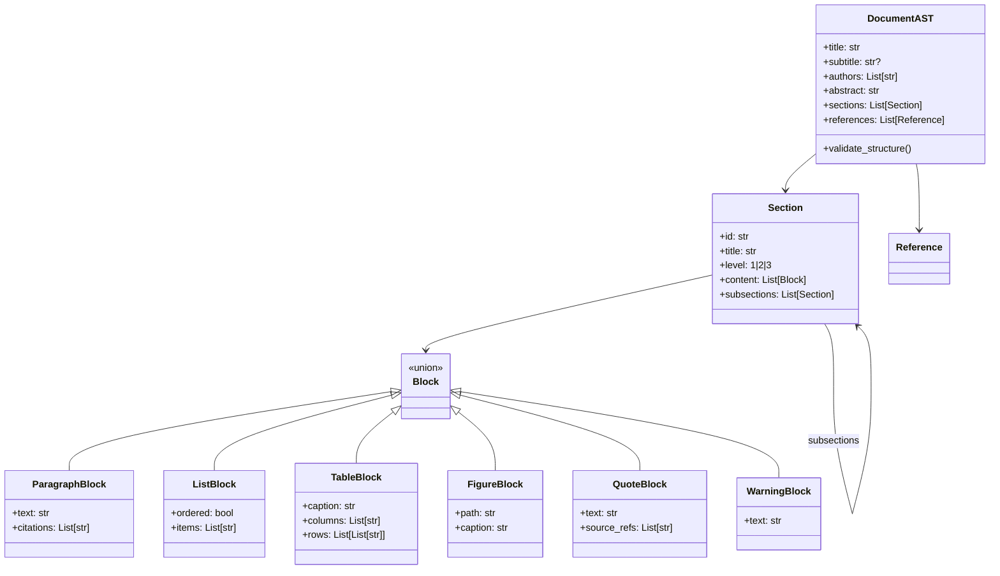
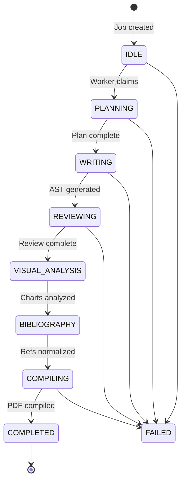

# Research Synthesis Architecture — Deep Dive

## Overview

The Rabbit-Hole-OS Research Synthesis Engine is a **multi-agent, async-pipeline system** that transforms selected graph nodes (web research) into structured academic documents. It spans ~2,700 lines of backend Python and integrates with a React/Electron frontend.

---

## 1. API Layer — [synthesis.py](file:///c:/Users/zakau/Rabbit-Hole-OS/apps/backend/app/api/v1/synthesis.py) (977 lines)

The API exposes multiple synthesis endpoints, each serving a different output format:

| Endpoint | Function | Output |
|:---|:---|:---|
| `POST /synthesize` | [create_synthesis](file:///c:/Users/zakau/Rabbit-Hole-OS/apps/backend/app/api/v1/synthesis.py#L29-L71) | Quick text summary |
| `POST /edge-label` | [get_edge_label](file:///c:/Users/zakau/Rabbit-Hole-OS/apps/backend/app/api/v1/synthesis.py#L82-L107) | Semantic edge label |
| `POST /search` | [search_nodes](file:///c:/Users/zakau/Rabbit-Hole-OS/apps/backend/app/api/v1/synthesis.py#L117-L151) | Node search results |
| `POST /research-pdf` | [generate_research_pdf](file:///c:/Users/zakau/Rabbit-Hole-OS/apps/backend/app/api/v1/synthesis.py#L217-L330) | Single-pass PDF |
| `POST /research-pdf-chunked` | [generate_chunked_research_pdf](file:///c:/Users/zakau/Rabbit-Hole-OS/apps/backend/app/api/v1/synthesis.py#L353-L493) | Multi-pass chunked PDF |
| `POST /research-pdf-latex` | [generate_latex_research_pdf](file:///c:/Users/zakau/Rabbit-Hole-OS/apps/backend/app/api/v1/synthesis.py#L509-L614) | LaTeX-compiled PDF |
| `POST /research-ast` | [get_research_ast](file:///c:/Users/zakau/Rabbit-Hole-OS/apps/backend/app/api/v1/synthesis.py#L631-L704) | JSON AST document |
| `POST /research-ast-stream` | [stream_research_ast](file:///c:/Users/zakau/Rabbit-Hole-OS/apps/backend/app/api/v1/synthesis.py#L707-L761) | **SSE-streamed pipeline** (main entry) |

The **primary production path** is `/research-ast-stream`, which delegates to the [SynthesisOrchestrator](file:///c:/Users/zakau/Rabbit-Hole-OS/apps/backend/app/services/orchestrator.py#33-563) and streams progress events via Server-Sent Events.

---

## 2. Orchestrator — [orchestrator.py](file:///c:/Users/zakau/Rabbit-Hole-OS/apps/backend/app/services/orchestrator.py) (567 lines)

The [SynthesisOrchestrator](file:///c:/Users/zakau/Rabbit-Hole-OS/apps/backend/app/services/orchestrator.py#33-563) is the **central coordinator**. It manages the full lifecycle of a synthesis job.

### Execution Flow

### Key Features

- **Deterministic Caching**: SHA256 hash of (query + nodes + edges + prompt_version) via [hashing.py](file:///c:/Users/zakau/Rabbit-Hole-OS/apps/backend/app/core/hashing.py). Completed jobs are served instantly on cache hit.
- **Redis Connection Pool**: Lazy-initialized with health checks and auto-reconnect ([_get_redis_pool](file:///c:/Users/zakau/Rabbit-Hole-OS/apps/backend/app/services/orchestrator.py#L77-L100)).
- **Sync Fallback**: If Redis/worker is unavailable, runs Planner → Writer → BibNormalizer inline ([_run_sync_fallback](file:///c:/Users/zakau/Rabbit-Hole-OS/apps/backend/app/services/orchestrator.py#L112-L205)).
- **Job Claiming**: Race-condition-safe claiming via DB status check to prevent duplicate work ([_claim_job_for_sync](file:///c:/Users/zakau/Rabbit-Hole-OS/apps/backend/app/services/orchestrator.py#L253-L284)).
- **Pub/Sub Streaming**: Subscribes to `job_updates:{job_id}` channel with health checks, timeout handling, and consecutive error limits.

---

## 3. Background Worker — [synthesis_worker.py](file:///c:/Users/zakau/Rabbit-Hole-OS/apps/backend/app/workers/synthesis_worker.py) (556 lines)

Uses **arq** (Redis-backed async task queue) to process jobs in background. The worker runs as a separate process: `arq app.workers.synthesis_worker.WorkerSettings`.

### Pipeline Steps

The main entry point [run_synthesis_pipeline](file:///c:/Users/zakau/Rabbit-Hole-OS/apps/backend/app/workers/synthesis_worker.py#L426-L528) chains 7 sequential steps:

Each step follows a **Read → Execute → Write** pattern:
1. **Read**: Short DB transaction to load job data
2. **Execute**: LLM agent call (outside transaction to avoid DB lock contention)
3. **Write**: Short DB transaction to save results

Each step returns a status string (`READY_FOR_WRITING`, `FAILED`, `ABORTED`, etc.) that determines pipeline continuation. Progress is published via Redis Pub/Sub after each step.

> [!IMPORTANT]
> There's a **duplicate [reviewer_task](file:///c:/Users/zakau/Rabbit-Hole-OS/apps/backend/app/workers/synthesis_worker.py#170-172) definition** at lines 170-171 and 173-208 in the worker file. The second definition shadows the first (a likely copy-paste leftover).

---

## 4. Agent System — [agents.py](file:///c:/Users/zakau/Rabbit-Hole-OS/apps/backend/app/services/agents.py) (564 lines)

### BaseAgent Framework

All agents inherit from [BaseAgent](file:///c:/Users/zakau/Rabbit-Hole-OS/apps/backend/app/services/agents.py#L30-L255), which provides:

| Capability | Method | Details |
|:---|:---|:---|
| LLM calling | [_call_llm_with_retry()](file:///c:/Users/zakau/Rabbit-Hole-OS/apps/backend/app/services/agents.py#151-182) | 3 retries with exponential backoff (1s, 2s, 4s) |
| Provider routing | [_call_llm_impl()](file:///c:/Users/zakau/Rabbit-Hole-OS/apps/backend/app/services/agents.py#183-256) | Supports **Gemini**, **OpenAI**, and **Chutes** (DeepSeek) |
| JSON extraction | [_clean_json_response()](file:///c:/Users/zakau/Rabbit-Hole-OS/apps/backend/app/services/agents.py#66-82) | Strips markdown fences, finds JSON boundaries |
| JSON parsing | [_parse_llm_json()](file:///c:/Users/zakau/Rabbit-Hole-OS/apps/backend/app/services/agents.py#83-109) | Parses with error recovery (quote fixing), validates expected keys |
| Input validation | [_validate_input()](file:///c:/Users/zakau/Rabbit-Hole-OS/apps/backend/app/services/agents.py#122-137) | Length checks, HTML unescaping, sanitization |
| Smart truncation | [_smart_truncate()](file:///c:/Users/zakau/Rabbit-Hole-OS/apps/backend/app/services/agents.py#110-121) | Preserves sentence boundaries |
| HTTP pooling | [_get_http_client()](file:///c:/Users/zakau/Rabbit-Hole-OS/apps/backend/app/services/agents.py#44-58) | Shared `httpx.AsyncClient` with connection limits |
| Logging | [_log_llm_call()](file:///c:/Users/zakau/Rabbit-Hole-OS/apps/backend/app/services/agents.py#138-150) | Request/response logging with previews |

The LLM call flow:

### The 7 Specialized Agents

#### 1. PlannerAgent — "AI Research Architect"
- **Input**: query, context (≤10K chars), graph relationships
- **Output**: `{ document_outline, section_dependencies, reasoning_plan, constraints }`
- **Purpose**: Creates the document blueprint — defines sections (max 8), cross-node dependencies, and prevents content duplication
- **Temperature**: 0.2 (slightly creative for structuring)

#### 2. WriterAgent — "Research Synthesis Writer"
- **Input**: query, context (≤20K chars), plan from Planner, references JSON
- **Output**: Full Document AST with `{ title, sections: [{ title, content: [blocks] }] }`
- **Purpose**: Generates the actual document content as a structured JSON AST. Inserts inline citations `[1]`, `[2]`
- **Temperature**: 0.1 (deterministic)
- **Post-processing**: Unwraps nested `{ document: { ... } }` responses

#### 3. ReviewerAgent — "Academic Validation Agent"
- **Input**: current AST, context (≤10K chars)
- **Output**: Corrected/refined AST
- **Purpose**: Detects hallucinations (facts not in context), missing citations, header repetition. Returns the corrected AST
- **Fault tolerance**: Returns original AST on failure (graceful degradation)

#### 4. ChartFigureAgent — "Visual Reasoning Agent"
- **Input**: document AST
- **Output**: `{ figures: [...] }` with chart type recommendations
- **Purpose**: Identifies numeric, comparative, or temporal data suitable for visualization
- **Fault tolerance**: Returns `{ figures: [] }` on failure (non-blocking)

#### 5. BibNormalizerAgent — "Citation & Reference Engine"
- **Input**: AST (with inline refs), all source references
- **Output**: `{ normalized_references: [...] }`
- **Purpose**: Deduplicates references, maps source URLs to unique ref_ids, cleans titles
- **Fault tolerance**: Returns original references on failure

#### 6. MemoryAgent — "Cross-Document Learning Engine"
- **Input**: query, AST title
- **Output**: Extracted concepts and structural patterns
- **Purpose**: Learns conceptual patterns from completed synthesis for future use. Does not block the pipeline on failure

#### 7. RecoveryAgent — "Stability & Recovery Engine"
- **Input**: error description, failed agent name, last output
- **Output**: `{ retry_action: "retry"|"stop", ... }`
- **Purpose**: Diagnoses pipeline failures (especially LaTeX compilation) and provides recovery plans. Used by [compilation_task](file:///c:/Users/zakau/Rabbit-Hole-OS/apps/backend/app/workers/synthesis_worker.py#332-425) during the compile-fix loop

---

## 5. Document AST Schema — [document_ast.py](file:///c:/Users/zakau/Rabbit-Hole-OS/apps/backend/app/services/document_ast.py) (244 lines)

Pydantic models defining the strict JSON structure that agents must produce:

The [validate_structure()](file:///c:/Users/zakau/Rabbit-Hole-OS/apps/backend/app/services/document_ast.py#157-223) method checks: missing titles, empty sections, and orphaned citations (refs in paragraphs not found in the references list).

---

## 6. Job Persistence — [job.py](file:///c:/Users/zakau/Rabbit-Hole-OS/apps/backend/app/models/job.py) (68 lines)

### State Machine

Key fields on [ResearchJob](file:///c:/Users/zakau/Rabbit-Hole-OS/apps/backend/app/models/job.py#21-51): [id](file:///c:/Users/zakau/Rabbit-Hole-OS/apps/backend/app/services/document_ast.py#140-145), `user_id`, `whiteboard_id`, `prompt_hash` (for caching), `input_payload` (JSON: context, source_map, edges), `output_ast` (final JSON), `output_pdf_url`, `document_version`, `parent_job_id` (for version chains), `metadata_` (stores plan, figures, latex).

[JobLog](file:///c:/Users/zakau/Rabbit-Hole-OS/apps/backend/app/models/job.py#52-68) entries track every agent's input/output for full observability.

---

## 7. Supporting Services

| Service | File | Purpose |
|:---|:---|:---|
| **VersioningService** | [versioning.py](file:///c:/Users/zakau/Rabbit-Hole-OS/apps/backend/app/services/versioning.py) | Semver versioning (v1.0.0 → v1.0.1) for document regeneration chains |
| **compute_job_hash** | [hashing.py](file:///c:/Users/zakau/Rabbit-Hole-OS/apps/backend/app/core/hashing.py) | Deterministic SHA256 from normalized inputs for cache deduplication |
| **LLM Client** | `llm.py` | Provider selection via `get_ai_client()` returning (provider, api_key, base_url) |

---

## 8. Frontend Integration

| Component | File | Purpose |
|:---|:---|:---|
| **SynthesisModal** | [SynthesisModal.tsx](file:///c:/Users/zakau/Rabbit-Hole-OS/apps/frontend/components/synthesis/SynthesisModal.tsx) | Modal UI for triggering synthesis, displaying results, copy/download |
| **SynthesisNode** | [SynthesisNode.tsx](file:///c:/Users/zakau/Rabbit-Hole-OS/apps/frontend/components/canvas/nodes/SynthesisNode.tsx) | Canvas node type for displaying synthesis results inline |
| **Shared Types** | [synthesis.ts](file:///c:/Users/zakau/Rabbit-Hole-OS/packages/shared-types/src/synthesis.ts) | TypeScript interfaces: [SynthesisData](file:///c:/Users/zakau/Rabbit-Hole-OS/packages/shared-types/src/synthesis.ts#1-8), [SynthesisRequest](file:///c:/Users/zakau/Rabbit-Hole-OS/packages/shared-types/src/synthesis.ts#9-13), [SynthesisResponse](file:///c:/Users/zakau/Rabbit-Hole-OS/packages/shared-types/src/synthesis.ts#14-17) |

---

## File Map

| Layer | File | Lines | Role |
|:---|:---|---:|:---|
| API | [api/v1/synthesis.py](file:///c:/Users/zakau/Rabbit-Hole-OS/apps/backend/app/api/v1/synthesis.py) | 977 | REST endpoints |
| Orchestrator | [services/orchestrator.py](file:///c:/Users/zakau/Rabbit-Hole-OS/apps/backend/app/services/orchestrator.py) | 567 | Job lifecycle, caching, streaming |
| Workers | [workers/synthesis_worker.py](file:///c:/Users/zakau/Rabbit-Hole-OS/apps/backend/app/workers/synthesis_worker.py) | 556 | arq background pipeline |
| Agents | [services/agents.py](file:///c:/Users/zakau/Rabbit-Hole-OS/apps/backend/app/services/agents.py) | 564 | 7 AI agents + BaseAgent |
| Schema | [services/document_ast.py](file:///c:/Users/zakau/Rabbit-Hole-OS/apps/backend/app/services/document_ast.py) | 244 | Pydantic AST models |
| Models | [models/job.py](file:///c:/Users/zakau/Rabbit-Hole-OS/apps/backend/app/models/job.py) | 68 | DB persistence |
| Hashing | [core/hashing.py](file:///c:/Users/zakau/Rabbit-Hole-OS/apps/backend/app/core/hashing.py) | 57 | Cache key generation |
| Versioning | [services/versioning.py](file:///c:/Users/zakau/Rabbit-Hole-OS/apps/backend/app/services/versioning.py) | 46 | Document version management |
| **Total Backend** | | **~3,079** | |
