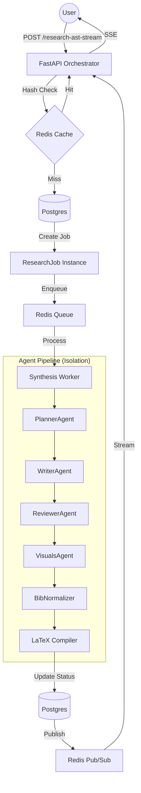

# Research Synthesis Engine Architecture

The Cognode Research Synthesis Engine is a production-grade, multi-agent runtime designed for high-fidelity academic synthesis. It leverages asynchronous workers, deterministic caching, and structured document schemas to provide a seamless research experience.

## 🏗️ Architecture Overview

The engine follows a **Master-Worker** architecture using FastAPI as the entry point and `arq` (Redis-based) for background job processing.



## 🧠 Specialized Agents

The engine orchestrates 7 specialized agents, each with a rigid JSON contract:

| Agent | Responsibility | Key Output |
| :--- | :--- | :--- |
| **Planner** | Defines document structure and research objectives. | Outline, Research Hypotheses |
| **Writer** | Synthesizes content into a high-fidelity AST. | Document AST (JSON) |
| **Reviewer** | Validates reasoning and injects academic critiques. | Refined AST, Critique Nodes |
| **ChartFigure** | Recommends data visualizations based on text. | Figure Metadata, Chart Types |
| **BibNormalizer** | Standardizes citations and Crossref lookups. | Normalized Bibliography |
| **Compilation** | Converts AST to LaTeX and produces PDF. | LaTeX Source, PDF Buffer |
| **Recovery** | Manages compile errors and patches AST nodes. | AST Patches |

## 🛡️ Core Features

### 1. Deterministic Caching
Uses SHA256 hashing of the user query, context items, and orchestrator version. If a matching completed job exists, results are served instantly.

### 2. Job Persistence & Observability
Every synthesis is a `ResearchJob` stored in PostgreSQL.
- **Granular Logging**: `JobLog` captures every agent's input/output for transparency.
- **State Machine**: Jobs transition through `IDLE`, `PLANNING`, `WRITING`, `COMPILING`, and `COMPLETED`.

### 3. Asynchronous Isolation
By using Redis queues, the engine prevents long-running LLM calls from blocking the API. Each agent runs in its own worker threshold, ensuring system stability under load.

### 4. Smart Versioning
Supports full history tracking via `parent_job_id`. When a user "Regenerates" or "Edits" a node, a new version (e.g., `v1.0.1`) is branched from the previous one, maintaining a perfect pedigree of research.

## 🛠️ Setup & Execution

### Prerequisites
- **Redis**: Required for the task queue and progress streaming.
- **Tectonic/pdflatex**: Required for PDF generation.

### Running the Worker
```bash
# From apps/backend
arq app.workers.synthesis_worker.WorkerSettings
```

### Configuration
Variables in `.env`:
- `REDIS_URL`: Connection string for the arq worker.
- `DATABASE_URL`: Postgres connection string.
- `GEMINI_API_KEY`: LLM provider key.

## 🧪 Verification
The engine's logic can be verified using the standalone script:
```bash
# From project root
$env:PYTHONPATH="apps/backend"; python verify_engine.py
```

---
*Documentation Version: 1.0.0*
