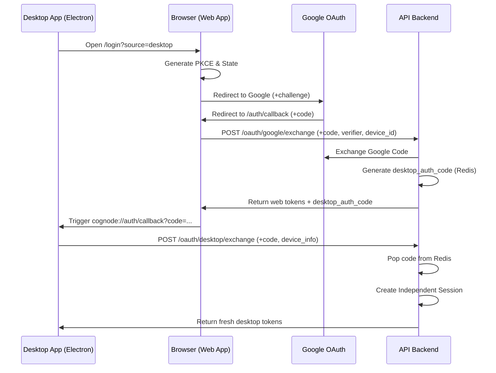

# Cognode Authentication System Design

This document details the architecture, flows, and state management of the Cognode authentication ecosystem, covering the Web Application (`apps/web`), the Desktop Electron Application (`apps/frontend`), and the FastAPI Backend (`apps/backend`).

## 1. System Architecture

The authentication system employs a distributed OAuth 2.0 PKCE (Proof Key for Code Exchange) flow, with the Web Application acting as the primary authentication surface and the Backend serving as the secure source of truth.

### Core Components
*   **Web App (`apps/web`)**: 
    The browser-based application where the initial Google OAuth request originates. It handles the Google Consent screen redirect, PKCE challenge generation, standard token exchange, and the UI for Desktop Handoff.
*   **Desktop App (`apps/frontend`)**: 
    The Electron-based desktop application. It avoids storing sensitive OAuth Client Secrets and avoids running loopback servers. Instead, it delegates login to the Web App and intercepts a custom OS-level protocol (`cognode://`) to receive a one-time authentication code.
*   **Backend (`apps/backend`)**: 
    The FastAPI server managing the database (`User` and `Session` models) and Redis. It handles exchanging Google codes for JWTs, user provisioning, independent session creation, and tracking active sessions across devices.

---

## 2. Authentication Flows

There are two primary login flows depending on where the user initiates the login.

### A. The Web PKCE Flow
When a user logs into the Web app (`http://localhost:3001/login`):

1.  **Initiation**: The user clicks "Continue with Google".
2.  **PKCE Generation**: The client generates a random `code_verifier` (stored in `localStorage` keyed by state) and a SHA-256 `code_challenge`.
3.  **Google Redirect**: The user is sent to the Google OAuth consent screen with the `code_challenge`.
4.  **Callback**: Google redirects back to `/auth/google` with an authorization `code`.
5.  **Exchange (`POST /oauth/google/exchange`)**: The Web App forwards the `code`, `code_verifier`, and `user_agent` to the backend.
6.  **Backend Verification**: The backend contacts Google to verify the code/verifier pair using the secure Client Secret.
7.  **Session & Tokens**: The backend creates a `Session` record, issues a JWT `access_token` and `refresh_token`, and returns them to the Web App.
8.  **Storage**: The Web App stores these tokens in `localStorage`.

### B. The Desktop Deep-Link Handoff Flow
The Desktop App delegates the OAuth consent screen to the user's default web browser to ensure security.

1.  **Trigger**: The Desktop App opens the default OS browser to `http://localhost:3001/login?source=desktop&device_id=XYZ`.
2.  **Web Context**: The Web App detects `source=desktop`, stores this context footprint in `localStorage`, and proceeds with the standard Web PKCE Flow.
3.  **Backend Injection (`POST /oauth/google/exchange`)**: During the token exchange, the Web App appends the desktop's context (`desktop_device_id`).
4.  **One-Time Code Generation**: The Backend recognizes the desktop context. Alongside returning the web JWTs, it generates a highly secure 32-byte **`desktop_auth_code`** and stores it in Redis with a 5-minute TTL.
5.  **Web Handoff UI**: The Web App displays a blocker "Access Granted" UI with a button: "Open in Cognode App".
6.  **Deep Linking (`cognode://`)**: Clicking the button triggers the OS custom protocol link: `cognode://auth/callback?code=<desktop_auth_code>`.
7.  **Desktop Resolution (`POST /oauth/desktop/exchange`)**: The Desktop App intercepts the link, extracts the `code`, and hits the backend `/oauth/desktop/exchange` endpoint, providing its specific `platform`, `device_name`, and `user_agent`.
8.  **Independent Session Creation**: The backend pops the `code` from Redis (single-use), looks up the user, and creates a **brand new independent `Session`** for the Desktop app, returning fresh JWTs directly to the Electron shell.

---

## 3. Token Exchange & State Management

### JWT Structure
Authentication relies on short-lived Access Tokens and long-lived Refresh Tokens.
*   **Access Token**: Contains `sub` (user_id), `email`, and `session_id`. Used for Authorization Headers (`Bearer <token>`). Expires in 60 minutes.
*   **Refresh Token**: Contains `sub` and `session_id`. Used to minted new Access Tokens without re-prompting the user. Expires in 30 days.

### Client-Side State Management
*   Both the Web and Desktop frontends store `auth_token` (access), `refresh_token`, and `cached_user` (profile data) in **`localStorage`**.
*   This ensures persistence across tabs and app reloads.
*   Cross-tab synchronization is supported by listening to the `storage` event in components like `Header.tsx` and `SettingsModal.tsx`.
*   A custom `auth-state-changed` window event handles immediate synchronization within the same tab when tokens are updated.

---

## 4. User and Session Management

### User Provisioning
During the first successful Google OAuth exchange, the backend checks if a `User` exists by their `google_id`. If not, a new user is automatically provisioned using their Google Email, Name, and Avatar URL. Profile updates on Google sync upon the next login.

### Active Session Management
Because each device (Web browser, Desktop Mac, Desktop Windows) negotiates tokens independently (even during the deep-link handoff), the backend tracks independent `Session` records in PostgreSQL.

*   `Session` footprint includes: `ip_address`, geo-location (`country`, `city`), `user_agent`, `platform`, `device_name`.
*   **Listing Sessions (`GET /oauth/sessions`)**: The `SettingsModal.tsx` fetches all un-revoked, un-expired sessions for the user. It highlights the session matching the token's current `session_id` as "Current".
*   **Revocation (`POST /oauth/sessions/{id}/revoke`)**: Users can selectively revoke a session from the Settings modal. The backend populates the `revoked_at` timestamp.
*   **Revoke All Others (`POST /oauth/sessions/revoke-all`)**: Invalidates all sessions except the active one.
*   **Redis Blacklist**: When a session is revoked, its refresh token hash is immediately placed on a Redis blacklist TTL to prevent further rotation.

---

## 6. Authentication Diagrams

### Desktop Deep-Link Flow


---

## 7. Setup Guide

### Google Cloud Console Configuration
1.  **Create Project**: Create a new project in [Google Cloud Console](https://console.cloud.google.com/).
2.  **OAuth Consent Screen**:
    - User Type: **External**
    - Scopes: `openid`, `profile`, `email`.
    - Add your email to **Test Users**.
3.  **Credentials**: Create an **OAuth 2.0 Client ID**.
    - **Application Type**: Web Application.
    - **Authorized Redirect URIs**:
        - `http://localhost:3001/auth/google/callback` (for local development)
        - `https://your-app.com/auth/google/callback` (for production)
4.  **Secrets**: Copy the **Client ID** and **Client Secret**.

### Environment Variables

#### Backend (`apps/backend/.env`)
```bash
GOOGLE_CLIENT_ID=...
GOOGLE_CLIENT_SECRET=...
OAUTH_REDIRECT_URI_WEB=http://localhost:3001/auth/google/callback
OAUTH_REDIRECT_URI_DESKTOP=cognode://auth/callback
JWT_SECRET_KEY=... # Generate with: openssl rand -hex 32
REDIS_URL=redis://localhost:6379/0
```

#### Web App (`apps/web/.env.local`)
```bash
NEXT_PUBLIC_GOOGLE_CLIENT_ID=...
NEXT_PUBLIC_API_URL=http://localhost:8000
NEXT_PUBLIC_OAUTH_REDIRECT_URI=http://localhost:3001/auth/google/callback
```

#### Desktop App (`apps/frontend/.env`)
```bash
NEXT_PUBLIC_API_BASE_URL=http://localhost:8000
NEXT_PUBLIC_DESKTOP_PROTOCOL=cognode
```

---

## 8. Troubleshooting

### "Error 400: invalid_request" in Browser
- **Cause**: Redirect URI mismatch or trying to use `cognode://` directly in a browser.
- **Fix**: Ensure `http://localhost:3001/auth/google/callback` is exactly matched in both your `.env` and Google Cloud Console. Google rejects custom protocols (`cognode://`) for web client types.

### Desktop App 401 Unauthorized after Web Logout
- **Status**: Fixed.
- **Details**: Sessions are now independent. Revoking a Web session no longer invalidates the Desktop session unless "Revoke All Sessions" is explicitly selected.

### Hydration Mismatch on `<html>` tag
- **Cause**: Browser extensions modifying attributes (e.g., Grammarly).
- **Fix**: The Root Layout uses `suppressHydrationWarning` on the `<html>` tag.
