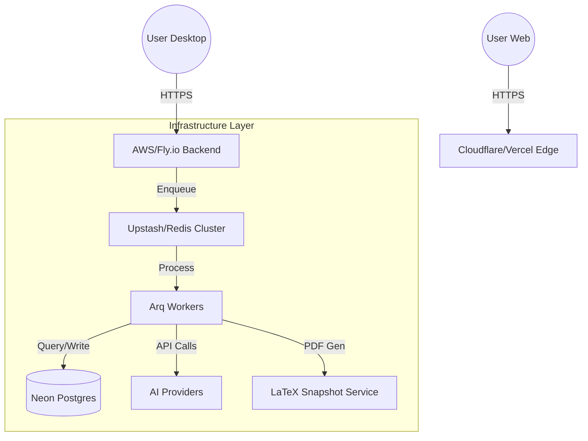

# Production Deployment Guide: Cognode Platform

This guide outlines the professional deployment strategy for the Cognode platform, ensuring high availability, security, and scalability across backend, web, and desktop components.

---

## 1. Production Architecture Overview

The Cognode production environment is designed for maximum isolation and deterministic execution.

### High-Level System Diagram


### Components
- **Public Edge**: Next.js landing page and web client.
- **Compute Layer**: FastAPI backend and isolated Arq workers.
- **Persistence Layer**: Neon Postgres (Serverless Storage) + Redis (Job Queue & Cache).
- **Client Layer**: Electron (Desktop) providing native knowledge graph visualization.

---

## 2. Environment Setup

### Required Tools
- **Node.js**: v20.x (LTS)
- **Python**: v3.11+
- **Docker**: For containerized backend/worker deployment.
- **System Dependencies**: 
  - `tectonic` or `pdflatex` for document generation.
  - Standard mathematical and academic fonts (CMU, Latin Modern).

---

## 3. Backend Deployment (FastAPI)

### Containerization Strategy
We use a slim multi-stage Dockerfile to keep the image footprint small and secure.

```dockerfile
# apps/backend/Dockerfile
FROM python:3.11-slim as builder
WORKDIR /app
COPY requirements.txt .
RUN pip install --user -r requirements.txt

FROM python:3.11-slim
WORKDIR /app
COPY --from=builder /root/.local /root/.local
COPY . .
ENV PATH=/root/.local/bin:$PATH
# Install Tectonic for headless LaTeX
RUN apt-get update && apt-get install -y libssl-dev ca-certificates && rm -rf /var/lib/apt/lists/*
CMD ["python", "-m", "uvicorn", "app.main:app", "--host", "0.0.0.0", "--port", "8080", "--workers", "4"]
```

### Production Best Practices
- **Uvicorn Workers**: Use `(2 * CPU stars) + 1` workers for the API.
- **Arq Workers**: Run separate worker processes for the `SynthesisWorker` to ensure LLM latency doesn't block API requests.
- **Health Checks**: Implement `/health` endpoints for load balancer readiness probes.
- **Fly.io / AWS App Runner**: Recommended for simple, auto-scaling backend hosting.

---

## 4. Database Deployment (Neon Postgres)

### Connection Management
Neon's serverless architecture handles scaling, but production apps should use **Connection Pooling**.

- **Pooler URL**: Always use the pooled connection string (usually port `5432` or specifically the `-pooler` suffix) to prevent exhausting Postgres connections during high worker concurrency.
- **Migrations**: Use `alembic` for structured schema updates. Never run `Base.metadata.create_all()` in production; always use migrations.

```bash
# Production migration command
DATABASE_URL=$PROD_DB_URL alembic upgrade head
```

---

## 5. Redis Setup

Redis identifies cache hits and manages the multi-agent job queue.

- **Queue Architecture**: Arq (Redis) handles the agent lifecycle.
- **Provider**: **Upstash Redis** is recommended for its serverless nature and built-in persistence.
- **Eviction Policy**: Use `allkeys-lru` for the caching layer, but ensure the **Queue keys** are never evicted (isolate if possible).
- **Persistence**: Enable AOF (Append Only File) to ensure job state survives a Redis restart.

---

## 6. AI Service Configuration

- **API Key Management**: Use a secret manager (AWS Secrets Manager, Vercel Secrets) rather than plain `.env` files.
- **Rate Limiting**: Implement token-bucket rate limiting at the API layer to prevent cost overruns.
- **Retry Policies**: Agents should use exponential backoff for 429/500 errors from model providers.

---

## 7. Web Landing Page (Next.js)

### Hosting
- **Vercel**: Recommended for deep Next.js integration and preview environments.
- **Custom Domains**: Configure SSL via Cloudflare or Vercel Edge.
- **Environment Separation**: Maintain distinct `STAGING` and `PRODUCTION` environments.

---

## 8. Authentication & OAuth Setup

### Google OAuth Flow
1. **Production URLs**: Update Google Console with `auth.cognode.ai` as the authorized origin.
2. **Deep Linking**: Ensure the desktop app is registered for `cognode://`.
3. **PKCE Security**: Mandatory for public clients (Electron). Never store client secrets in the desktop binary.

---

## 9. Desktop App Build (Electron)

### Production Security
- **Preload Scripts**: Use strict `contextIsolation` and `sandbox: true`.
- **IPC Rules**: Whitelist specific channels; never allow the renderer to execute raw shell commands.
- **Environment Switching**: Use `process.env.NODE_ENV` to toggle between local dev and production API endpoints.

---

## 10. Windows Build Pipeline

### Code Signing
- **Requirement**: A standard or EV Code Signing Certificate.
- **Tools**: `electron-builder` + `signtool.exe`.
- **Targets**: Generate `AppX`, `MSI`, or `NSIS` installers.

### Versioning
Follow Semantic Versioning (SemVer). Use GitHub Releases to host the `.exe` and `RELEASES` manifest for the auto-updater.

---

## 11. macOS Build Pipeline

### Notarization
Every macOS build must be notarized by Apple.
- **Requirements**: Apple Developer Program membership.
- **Process**: `electron-notarize` integrated into the `electron-builder` "afterSign" hook.
- **Architectures**: Build **Universal Binaries** to support both Intel and Apple Silicon (M1/M2/M3) natively.

---

## 12. Release Distribution Strategy

- **Installer Hosting**: Use a CDN or GitHub Releases for signed binaries.
- **Update Policy**: Implement mandatory updates for critical security patches and "notify-only" for feature releases.
- **Rollback**: Maintain the previous two versions on the CDN to allow rapid reversion in case of a regression.

---

## 13. Environment Management

| Env | Purpose | DB |
| :--- | :--- | :--- |
| **Development** | Local testing | Local PG |
| **Staging** | QA and pre-release | Neon Staging Branch |
| **Production** | Live traffic | Neon Main Branch |

---

## 14. Monitoring & Observability

- **Sentry**: For frontend/backend error tracking.
- **Datadog / New Relic**: For system-level metrics and trace monitoring.
- **Job Monitoring**: Build a dashboard to track Arq queue depth and agent failure rates.

---

## 15. Security Best Practices

1. **Secret Management**: No secrets in source code. Use 1Password CLI or AWS Secrets Manager.
2. **PDF Sandboxing**: LaTeX compilation should occur in a container with zero network access and no filesystem access outside the target temp directory.
3. **CORS**: Strictly whitelist only the web landing page and known desktop origins.

---

## 16. Backup & Recovery

- **Database**: Enable Neon's automatic point-in-time recovery (PITR).
- **Disaster Recovery**: Maintain a cross-region replica or nightly S3 exports of the primary Postgres data.

---

## 17. Production Checklist

- [ ] SSL certificates verified for all domains.
- [ ] OAuth consent screen "Verified" by Google.
- [ ] Code signing certificates active.
- [ ] Rate limits configured on LLM endpoints.
- [ ] Database migrations tested against staging data.
- [ ] Sentry/Monitoring integration active.
- [ ] Auto-updater manifest verified.

---

## 18. Post-Launch Scaling Strategy

- **Worker Autoscaling**: Scale the number of Arq workers based on Redis queue depth.
- **Postgres Scaling**: Monitor compute units in Neon and adjust "Autoscale" limits.
- **Cost Control**: Implement hard caps on monthly LLM API spending to prevent "bill shock."

---
*Generated by the Cognode DevOps Team | v1.0*
