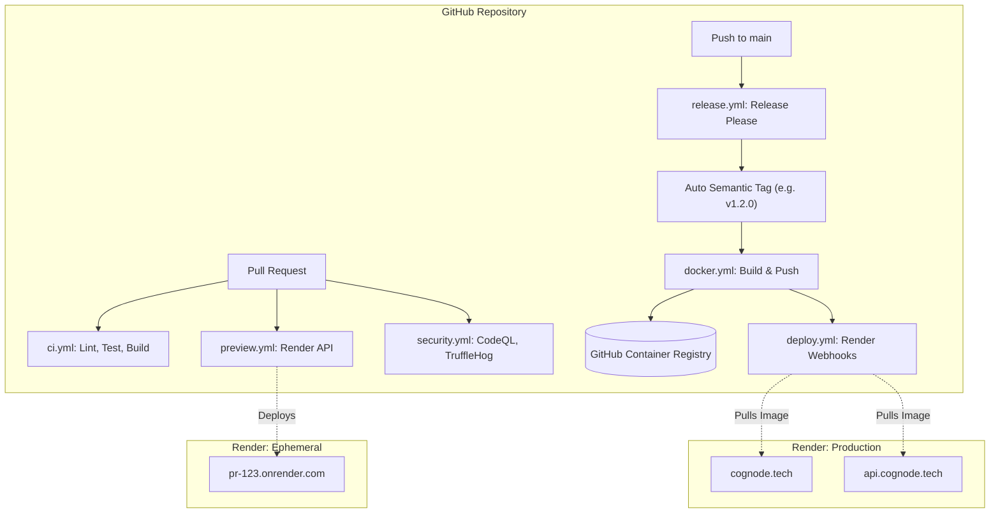

# CI/CD Infrastructure Walkthrough

This document serves as the final architectural diagram and setup instruction manual for the Rabbit-Hole-OS production CI/CD pipelines.

## 1. System Architecture Diagram

## 2. Infrastructure Highlights

- **Intelligent Builds**: The [ci.yml](file:///c:/Users/zakau/Rabbit-Hole-OS/.github/workflows/ci.yml) pipeline utilizes `dorny/paths-filter` and `npx turbo` to guarantee that only the affected apps (and their dependencies) are rebuilt and tested during a PR.
- **Preview Environments**: Render's API is directly triggered in [preview.yml](file:///c:/Users/zakau/Rabbit-Hole-OS/.github/workflows/preview.yml) to automatically spin up (and tear down) temporary isolated instances per PR.
- **Docker Optimization**: The `apps/web` and `apps/backend` Dockerfiles run as unprivileged `non-root` users, employ multi-stage construction, and export specifically as Next.js standalone and Python-slim images. GitHub Actions layer caching enables blistering fast container generation.
- **Security Posture**: Trivy scans Docker container layers (`HIGH`/`CRITICAL` vulnerability blocks), CodeQL analyzes code logic flaws, and TruffleHog prevents secret leakage natively via `security.yml`.
- **Automated Rollbacks**: Deployment failures in Render instantly pause rollouts. To trigger a manual rollback, re-run an older `deploy.yml` workflow run via the GitHub Actions dashboard. 
- **Automated Versioning**: Google's `release-please` action automatically generates Git tags and standard `CHANGELOG.md` updates based on Conventional Commits conventions (e.g., `feat: xxx` triggers minor bumps).

## 3. Required GitHub Secrets Configuration

To fully activate the CI/CD pipeline, navigate to **Settings > Secrets and variables > Actions** in the GitHub repository and configure the following:

| Secret Name | Description |
|---|---|
| `RENDER_API_KEY` | Render Personal Access Token for triggering Preview environments. |
| `RENDER_SERVICE_ID` | The specific `srv-*` ID representing the web service for PR previews. |
| `RENDER_DEPLOY_WEBHOOK_URL_WEB` | Webhook URL from the Render dashboard to trigger `web` prod deploys. |
| `RENDER_DEPLOY_WEBHOOK_URL_BACKEND` | Webhook URL for the `backend` API production service. |
| `RENDER_DEPLOY_WEBHOOK_URL_WORKER` | Webhook URL for the async backend worker production service. |

*(Note: The `GITHUB_TOKEN` is automatically utilized to sign into the GitHub Container Registry (`ghcr.io`) without requiring manual setup)*

This concludes the enterprise-grade CI/CD implementation for Rabbit-Hole-OS.
